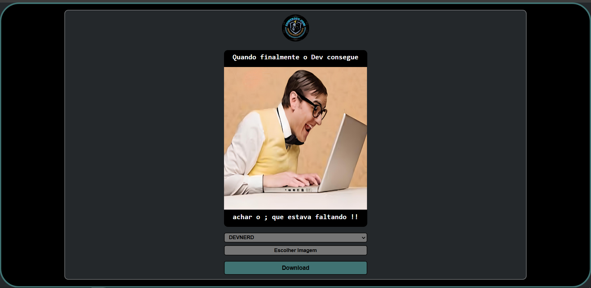
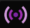
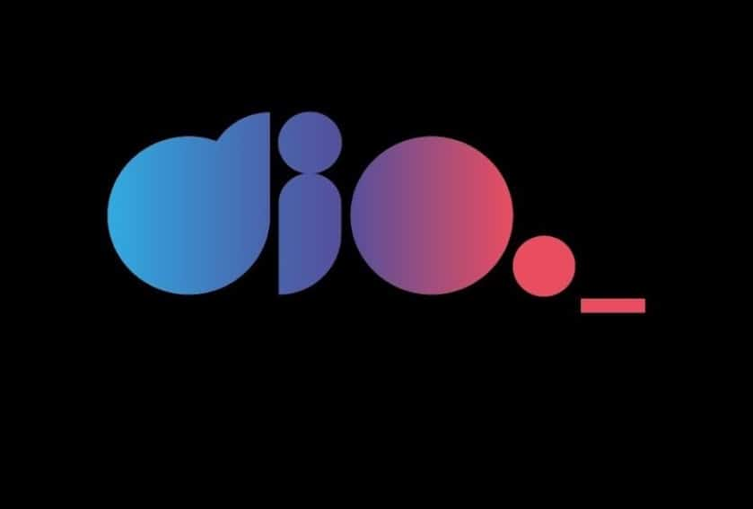

# Soft App to consolidate Frontend concepts with HTML, CSS and JS

## Learning project

### Frontend immersion class offered by DIO

Taught by _Felipe Silva Aguiar_ - Tech Educator at DIO.
<br>

Below is the result of the completed project:
<br>

> 🎯 Objective:
>
> - I decided to develop this mini frontend application **_`"Soft App"`_** to compare, elucidate and consolidate web development concepts that I had learned in a previous DevClub Fullstack Dev course.The project implements a simple frontend with **_[HTML](https://developer.mozilla.org/en-US/docs/Web/HTML)_**,**_[CSS](https://developer.mozilla.org/en-US/docs/Web/CSS)_** and pure **_[JavaScript](https://developer.mozilla.org/en-US/docs/Web/JavaScript)_** to manage the creation and download of memes, along with a responsive user interface with a focus on usability. ✅

> - This project reinforced my knowledge in DOM manipulation with pure JavaScript, responsive design with CSS (not presented in the class) and integration of features such as image upload and screenshot using the HTML2Canvas library which improved my skills in frontend development and basic architecture. ✅
>   > - The simplicity of the framework, with a focus on a lightweight and functional application, added to the charisma and excellent teaching of the Educator, made the development process fun and educational.

<br>

### 🚀 Features

- Generate custom memes with top and bottom text
- Upload custom images
- Select pre-made memes via a drop-down list
- Or select images from other sources directly from your local device
- Download the generated meme as an image
- Responsive interface for desktop, smartphones and tablets

<br>

<p align="center">

</p>
<br>
<div align="center">
 <a href="https://memesmachine.onrender.com/" >Click here to try it out .. thanks for your interest!</a>
 <p>( 🖱️ Ctrl + click to open in a new tab )</p>
</div>
 <br>
 <br>

### Adjustments and improvements

The project was fully completed and some of the resources used were:

- [x] **Frontend**:&nbsp;&nbsp;&nbsp;&nbsp;&nbsp;&nbsp;[](https://developer.mozilla.org/en-US/docs/Web/HTML) &nbsp;&nbsp;[](https://developer.mozilla.org/en-US/docs/Web/CSS)&nbsp;&nbsp;[](https://developer.mozilla.org/en-US/docs/Web/JavaScript)&nbsp;&nbsp;[](https://html2canvas.hertzen.com/)
      <br>

- [x] **Development Tools and Testing**:&nbsp;&nbsp;&nbsp;[](https://marketplace.visualstudio.com/items?itemName=ritwickdey.LiveServer)&nbsp;&nbsp;`Manual testing with Browser DevTools`
      <br>

- [x] **Hosting and Deployment**:&nbsp;&nbsp;&nbsp;&nbsp;&nbsp;&nbsp;[](https://pages.github.com/)
      <br>

- [x] **Planning and Editor**:&nbsp;&nbsp;&nbsp;&nbsp;&nbsp;&nbsp;[](https://figma.com/)&nbsp;&nbsp;[](https://code.visualstudio.com/)
      <br>

#### ⚙️ Steps for the project

✔️ - Planning: The project was structured with a focus on a functional mini app, `avoiding complex dependencies` .<br>
✔️ - Configure the environment:

- [ ] If you choose, clone the repository:

```bash
git clone https://github.com/ed-radanovis/Soft-App-Memes-Machine-DIO-11-2022.git
```

- [ ] Navigate to the project folder: `cd Soft-App-Memes-Machine-DIO-11-2022` or the folder you created and named.

---

#### 🖥️ Frontend

✔️ - Navigate to the root of the project: where `index.html, styles/ and javascript/` are located.<br>
✔️ - Make sure the dependencies are available:

- [x] &nbsp;&nbsp;&nbsp;Download the `html2canvas.js` file and place it in the `./javascript/` folder.

✔️ - Open the `index.html` file directly in the browser or host it via `GitHub Pages`. <br>

✔️ - Prepare at least 5 custom images with a minimum resolution of `704 x 704 pixels`, store them in the `assets/pictures` folder, and use them as predefined options in the dropdown list. <br>

---

#### 🌐 Deployment

✔️ - Hosting on GitHub Pages (free tier):

- [x] &nbsp;&nbsp;&nbsp; Go to [GitHub](https://github.com).
- [x] &nbsp;&nbsp;&nbsp; Navigate to your repository (e.g., `https://github.com/repository-created-by-you`).
- [x] &nbsp;&nbsp;&nbsp; Enable GitHub Pages: Go to the repository settings, scroll to the **_`"Pages"`_** section, select the branch (e.g., `main` or `gh-pages`), and set the root directory to `/` (project root).
- [x] &nbsp;&nbsp;&nbsp; Deploy and access the generated URL (e.g., `https://your-username.github.io/repository-name/`).

✔️ - Optional Hosting on Render (free tier):

- [ ] &nbsp;&nbsp;&nbsp; Go to [Render](https://render.com).
- [ ] &nbsp;&nbsp;&nbsp; Create a new Static Site, connect the repository `https://github.com/repository-created-by-you`.
- [ ] &nbsp;&nbsp;&nbsp; Set the root directory to `/` (project root).
- [ ] &nbsp;&nbsp;&nbsp; Deploy and access the generated URL (e.g., `https://your-app-name.onrender.com`).

📝 Note: The project uses a basic folder structure (`assets/`, `javascript/`, `styles/`) and the `html2canvas` library for screen capture.
It is a lightweight frontend application focused on meme generation and download functionality.

---

#### 🔬 Testing

✔️ - Manual Testing:

- [x] &nbsp;&nbsp;&nbsp;Check the generation of memes with text and images.
- [x] &nbsp;&nbsp;&nbsp;Test image uploads and downloads on desktops, smartphones, and tablets.
- [x] &nbsp;&nbsp;&nbsp;Use DevTools (F12 > Toggle Device Toolbar) or another tool of your choice to simulate different resolutions.

---

<h4 align="center">
  🤝 Collaborators
<h4/>
<br>
<table align="center"
  <tr>
    <td align="center">
      <a href="https://www.linkedin.com/in/edmar-radanovis-0130b611a/">
        <br>
      <sub>
        <b>Edmar Radanovis</b>
      </sub>
      </a>
    </td>
    <td align="center">
      <a href="https://www.dio.me/">
        <br>
      <sub>
        <b>DIO.me</b>
      </sub>
      </a>
    </td>
  </tr>
</table>
<br>
<br>

[⬆ Back to top](#soft-app-to-consolidate-frontend-concepts-with-html-css-and-js)
